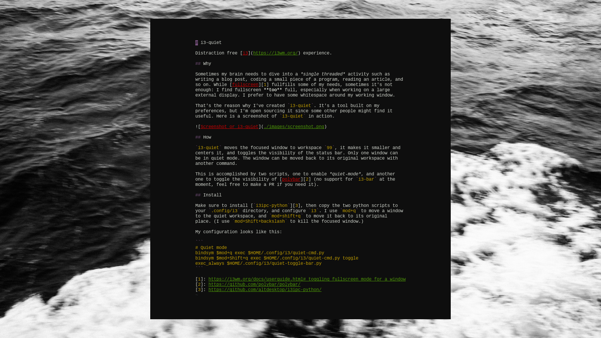

# i3-quiet

Distraction free [i3](https://i3wm.org/) experience.

## Why

Sometimes my brain needs to dive into a *single threaded* activity such as writing a blog post, coding a small piece of a program, reading an article, and so on. While [fullscreen][1] fullfills some of my needs, sometimes it's not enough: I find fullscreen **too** full, especially when working on a large external display. I prefer to have some whitespace around my working window.

That's the reason why I've created `i3-quiet`. It's a tool built on my preferences, but I'm open sourcing it since some other people might find it useful. Here is a screenshot of `i3-quiet` in action.



## How

`i3-quiet` moves the focused window to workspace `99`, it makes it smaller and centers it, and toggles the visibility of the status bar. Only one window can be in quiet mode. The window can be moved back to its original workspace with another command.

This is accomplished by two scripts, one to enable *quiet-mode*, and another one to toggle the visibility of [polybar][2] (no support for `i3-bar` at the moment, feel free to make a PR if you need it).

## Install

Make sure to install [`i3ipc-python`][3], then copy the two python scripts to your `.config/i3` directory, and configure `i3`. I use `mod+q` to move a window to the quiet workspace, and `mod+shift+q` to move it back to its original place. (I use `mod+Shift+backslash` to kill the focused window.)

My configuration looks like this:

```
# Quiet mode
bindsym $mod+q exec $HOME/.config/i3/quiet-cmd.py
bindsym $mod+Shift+q exec $HOME/.config/i3/quiet-cmd.py toggle
exec_always $HOME/.config/i3/quiet-toggle-bar.py
```

[1]: https://i3wm.org/docs/userguide.html#_toggling_fullscreen_mode_for_a_window
[2]: https://github.com/polybar/polybar/
[3]: https://github.com/altdesktop/i3ipc-python/
